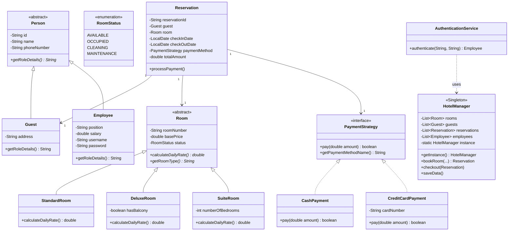
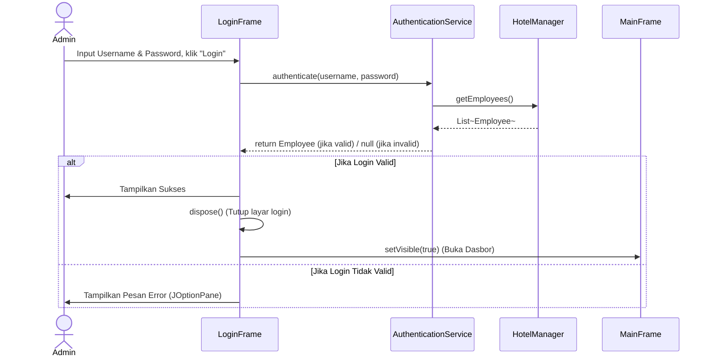
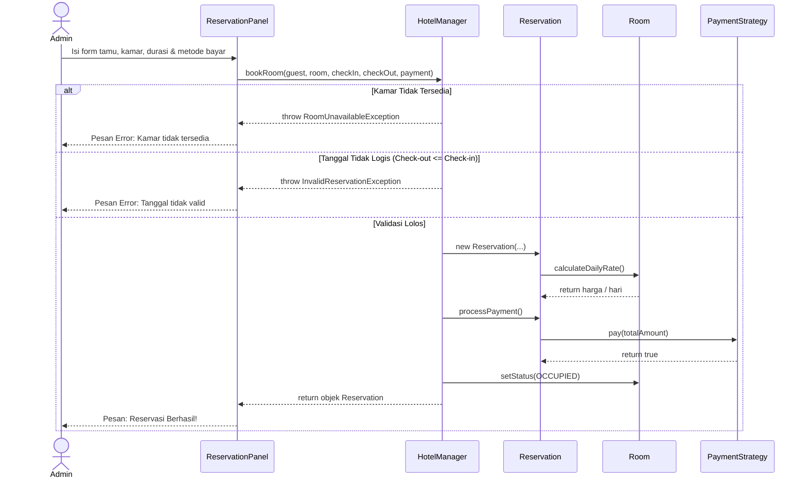

# Laporan Proyek Akhir: Pemrograman Berorientasi Objek
## Sistem Manajemen Hotel Berbasis GUI (Java Swing)

---

### 1. Identitas Tim
- **Ketua Kelompok:** [Nama Ketua] - [NIM Ketua]
- **Anggota 1:** [Nama Anggota 1] - [NIM Anggota 1]
- **Anggota 2:** [Nama Anggota 2] - [NIM Anggota 2]

---

### 2. Deskripsi Ringkas Program
Aplikasi ini adalah **Sistem Manajemen Hotel** berbasis Desktop (Java Swing) yang dirancang khusus untuk mempermudah pekerjaan admin atau resepsionis hotel. Konsep utamanya adalah menyediakan sebuah "dasbor pintar" di mana admin bisa mengurus seluruh kegiatan operasional hotel secara terpusat dan praktis.

**Fitur dan Alur Kerja Aplikasi:**
Secara garis besar, aplikasi ini menawarkan alur kerja berikut bagi admin:
1. **Keamanan via Login:** Saat aplikasi dibuka, admin diwajibkan untuk *login* terlebih dahulu menggunakan *Username* dan *Password*. Fitur ini memastikan bahwa hanya staf berwenang yang dapat mengakses sistem.
2. **Manajemen Kamar Fleksibel:** Melalui menu *Kelola Kamar*, admin dapat menambahkan kamar baru ke dalam sistem. Admin bebas menentukan tipe kamar (*Standard*, *Deluxe*, atau *Suite*), serta menginput fitur spesifik seperti ketersediaan balkon atau jumlah kasur. Selain itu, admin dapat memperbarui status kamar secara langsung (misal: dari "Tersedia" menjadi "Sedang Dibersihkan").
3. **Pencatatan Reservasi Tamu:** Ketika ada tamu yang datang, admin dapat membuka menu *Reservasi*, memasukkan data diri tamu, lalu memilih kamar yang tersedia beserta durasi menginapnya.
4. **Penghitungan Tagihan Dinamis (*Dynamic Pricing*):** Sistem akan menghitung total biaya secara otomatis dan dinamis. Kalkulasi harga akan langsung menyesuaikan dengan durasi menginap dan spesifikasi dari tipe kamar yang dipilih (misalnya, tipe *Suite* memiliki tambahan tarif yang dikalikan dengan jumlah kasurnya).
5. **Pemrosesan Pembayaran:** Aplikasi mendukung pemrosesan metode bayar secara bergantian. Admin dapat mencatat pembayaran tamu menggunakan metode Tunai (*Cash*) maupun memvalidasi input nomor Kartu Kredit.
6. **Penyimpanan Data Berbasis File:** Seluruh entri data hotel (kamar, tamu, dan transaksi) disimpan secara otomatis ke dalam file lokal (`hotel_data.dat`) menggunakan teknik *Object Serialization*. Data ini akan langsung dimuat ulang secara utuh pada saat aplikasi kembali dijalankan.

---

### 3. Rancangan Class (Class Diagram) & Arsitektur
Arsitektur program kami dipisahkan ke dalam *package* yang berbeda: `model` (Entitas data), `service` (Logika bisnis), `gui` (Antarmuka), dan `exception` (Penanganan eror kustom).



**Penjelasan Relasi UML:**
- **Generalization (Pewarisan):** `Person` ke `Guest` dan `Employee`. `Room` ke `StandardRoom`, `DeluxeRoom`, dan `SuiteRoom`.
- **Realization (Implementasi):** `PaymentStrategy` diimplementasikan oleh `CashPayment` dan `CreditCardPayment`.
- **Association:** `Reservation` terhubung erat dan menggunakan *instance* dari objek `Guest`, `Room`, dan `PaymentStrategy`.
- **Dependency:** `AuthenticationService` bergantung pada `HotelManager` untuk mengambil data `Employee`.

---

### 4. Sequence Diagram

#### A. Alur Autentikasi (Login)


#### B. Alur Transaksi Reservasi


---

### 5. Algoritma Logika Bisnis Penting

Aplikasi ini tidak mengandalkan *database* eksternal seperti SQL, sehingga semua operasi menggunakan manipulasi tipe data *Collection* (List) dan penyimpanan berbasis objek (algoritma Object Serialization).

1. **Algoritma Dynamic Pricing (Polimorfisme dalam Kalkulasi):**
   Pada saat objek `Reservation` dibuat, harga total dihitung menggunakan metode `calculateDailyRate()`. Metode ini memiliki logika matematika yang berbeda tergantung instansiasi kelas anak:
   - `StandardRoom`: Langsung mengembalikan `basePrice`.
   - `DeluxeRoom`: `basePrice * 1.2` + $50 (Syarat: boolean `hasBalcony` = true).
   - `SuiteRoom`: `basePrice * 1.5` + (`numberOfBedrooms` * $100).
   Program tidak memerlukan blok `if-else` atau `switch` untuk mengecek tipe kamar; polimorfisme JVM (Java Virtual Machine) secara otomatis memanggil blok matematika yang tepat berdasarkan *runtime type* dari objek.

2. **Algoritma Persistensi Data (Data Serialization):**
   Logika utama untuk *menyimpan* state aplikasi dilakukan dengan membungkus kelas `HotelManager` ke dalam arus bit (*Byte Stream*). 
   - **Menyimpan:** `ObjectOutputStream.writeObject(manager)` menulis status dari seluruh kamar, reservasi, dan daftar admin ke dalam bentuk *binary* `hotel_data.dat`.
   - **Memuat:** Saat program dinyalakan, `ObjectInputStream.readObject()` merekonstruksi objek tersebut dari file, sehingga seluruh tabel langsung terisi kembali.

---

### 6. Cuplikan Antarmuka Aplikasi (GUI)

> **Catatan Tim:** Silakan ambil tangkapan layar (*screenshot*) saat Anda menjalankan aplikasi dan tempelkan di bawah ini.

1. **Menu Autentikasi (Login Frame)**
   *(Antarmuka awal yang membatasi masuknya pengguna tanpa akun pegawai).*
   *[INSERT SCREENSHOT HERE]*

2. **Dashboard Overview**
   *(Halaman utama yang merangkum metrik performa hotel seperti total kamar dan reservasi).*
   *[INSERT SCREENSHOT HERE]*

3. **Menu Kelola Kamar & Tambah Kamar**
   *(Menampilkan daftar kamar yang harganya telah dihitung secara dinamis. Admin dapat menambah kamar baru dengan form).*
   *[INSERT SCREENSHOT HERE]*

4. **Menu Form Reservasi**
   *(Form pengisian data tamu, *combo-box* tipe kamar, *combo-box* metode bayar).*
   *[INSERT SCREENSHOT HERE]*

---

### 7. Penjelasan Penerapan Konsep PBO & Bukti (Source Code)

Dalam pengembangan aplikasi ini, kami menerapkan prinsip OOP tingkat lanjut, yang tidak hanya mencakup pilar dasar, namun juga prinsip desain arsitektural (SOLID Principles).

#### A. Encapsulation (Enkapsulasi)
**Teori:** Prinsip membungkus dan menyembunyikan data (atribut) di dalam kelas agar tidak dapat dimodifikasi langsung oleh pihak luar demi menjaga integritas data.
**Penerapan:** Semua entitas (`Employee`, `Guest`, `Reservation`) mendeklarasikan *fields* dengan *modifier* `private`. Modifikasi hanya bisa dilakukan via konstruktor atau metode `setter` & `getter`.
**Bukti Kode (`Employee.java`):**
```java
public class Employee extends Person {
    private String position;
    private String username;
    private String password; // Data rahasia dilindungi

    // Akses dikontrol via Getter
    public String getUsername() {
        return username;
    }
}
```

#### B. Inheritance (Pewarisan)
**Teori:** Menurunkan struktur dan perilaku (atribut & metode) dari *Superclass* ke *Subclass* untuk mencapai tingkat penggunaan ulang (*Code Reusability*) yang maksimal.
**Penerapan:** Daripada menulis atribut "Nama", "Nomor Telepon", dan "ID" secara berulang-ulang, kami membuat *Abstract Class* `Person`. Kelas `Guest` (Tamu) dan `Employee` (Pegawai) sama-sama mewarisinya secara hierarkis menggunakan kata kunci `extends`.
**Bukti Kode (`Guest.java`):**
```java
public class Guest extends Person {
    private String address;
    public Guest(String id, String name, String phoneNumber, String address) {
        // Memanggil konstruktor Superclass (Person)
        super(id, name, phoneNumber); 
        this.address = address;
    }
}
```

#### C. Abstraction (Abstraksi)
**Teori:** Menekankan pada "Apa yang dapat dilakukan oleh objek", alih-alih "Bagaimana objek tersebut melakukannya".
**Penerapan:** Sistem ini mengabstraksi konsep kamar melalui kelas abstrak `Room`. Sistem tidak peduli bagaimana tarif kamar dihitung, sistem hanya memaksa bahwa setiap jenis kamar PASTI memiliki cara untuk menghitung `calculateDailyRate()`.
**Bukti Kode (`Room.java`):**
```java
public abstract class Room implements Serializable {
    private String roomNumber;
    private double basePrice;

    // Metode abstrak, implementasi spesifik diserahkan kepada subclass
    public abstract double calculateDailyRate(); 
}
```

#### D. Polymorphism (Polimorfisme)
**Teori:** Kemampuan suatu objek atau antarmuka tunggal untuk mengambil berbagai bentuk (*Many Forms*) pada saat dieksekusi.
**Penerapan (*Dynamic Method Dispatch*):** Di layar `RoomPanel`, program melakukan iterasi pada sekumpulan objek `Room`, lalu memanggil `calculateDailyRate()`. JVM secara dinamis mengeksekusi rumus yang berbeda tergantung apakah objek tersebut *Standard*, *Deluxe*, atau *Suite*.
**Bukti Kode (`SuiteRoom.java` vs `StandardRoom.java`):**
```java
// Implementasi pada StandardRoom
@Override
public double calculateDailyRate() {
    return getBasePrice(); // Tarif flat
}

// Implementasi pada SuiteRoom
@Override
public double calculateDailyRate() {
    return getBasePrice() * 1.5 + (numberOfBedrooms * 100.0); // Tarif kompleks
}
```

#### E. Interfaces & Strategy Pattern (SOLID: Open/Closed Principle)
**Teori:** Memisahkan algoritma ke dalam antarmuka sendiri sehingga fungsionalitas aplikasi dapat diperluas tanpa harus memodifikasi kelas yang sudah ada.
**Penerapan:** Logika pembayaran kami pisahkan dengan antarmuka `PaymentStrategy`. Jika hotel ingin menambahkan metode "QrisPayment" di masa depan, kita tidak perlu memodifikasi kelas `Reservation`. Kita cukup membuat kelas baru yang mengimplementasikan `PaymentStrategy`.
**Bukti Kode (`PaymentStrategy.java` dan penggunaannya):**
```java
public interface PaymentStrategy extends Serializable {
    boolean pay(double amount);
    String getPaymentMethodName();
}

public class Reservation {
    // Bergantung pada abstraksi Interface, bukan pada implementasi nyata (Cash/CC)
    private PaymentStrategy paymentMethod; 

    public void processPayment() {
        paymentMethod.pay(totalAmount);
    }
}
```

#### F. Exception Handling (Penanganan Eror)
**Teori:** Mekanisme untuk mengelola situasi anomali (kesalahan) secara terstruktur agar program tidak mengalami *crash/force close*.
**Penerapan:** Kami tidak menggunakan kembalian `-1` atau tipe data hampa (*null*) untuk menandakan gagalnya pemesanan. Kami merancang kelas *Exception* buatan sendiri yang extends ke `Exception`.
**Bukti Kode (`HotelManager.java`):**
```java
public Reservation bookRoom(...) throws RoomUnavailableException {
    if (room.getStatus() != RoomStatus.AVAILABLE) {
        // Mencegah booking bertumpuk secara paksa ke bisnis logika atas
        throw new RoomUnavailableException("Kamar " + room.getRoomNumber() + " tidak tersedia.");
    }
}
```

#### G. Single Responsibility Principle (SOLID)
**Penerapan:** Kelas `HotelManager` sebelumnya menangani daftar kamar dan pembuatan reservasi. Ketika kami menambah fitur Autentikasi Login, kami tidak membebani `HotelManager` dengan logika validasi *password*. Kami menciptakan kelas khusus `AuthenticationService` semata-mata hanya untuk urusan pengecekan *username* & *password*.

---

### 8. Kesimpulan
Proyek "Sistem Manajemen Hotel" yang kami ajukan ini bukan hanya sekadar entri data biasa, namun bertindak sebagai landasan demonstrasi pengaplikasian teori PBO tingkat lanjut. Pemilihan pola arsitektural seperti MVC, Polimorfisme pada kalkulasi harga, *Single-Responsibility* pada autentikasi, serta penggunaan Abstraksi (Abstract Class dan Interface) membuktikan efisiensi struktur hierarki yang kokoh, mudah dirawat (*maintainable*), dan dijamin kesiapannya (*scalable*) bila terdapat penambahan fitur di masa yang akan datang.
